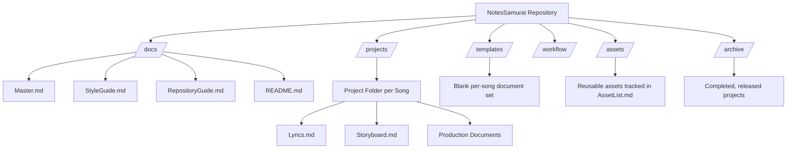
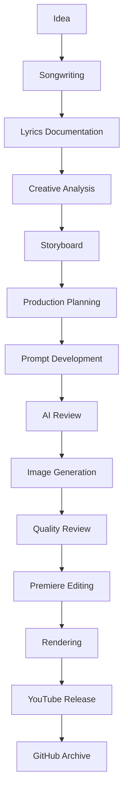
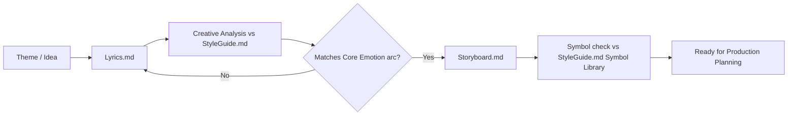
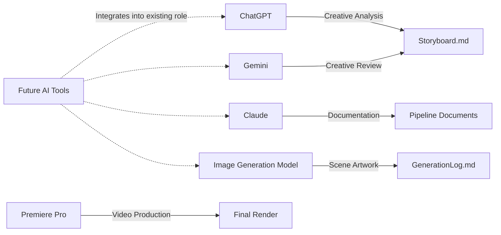
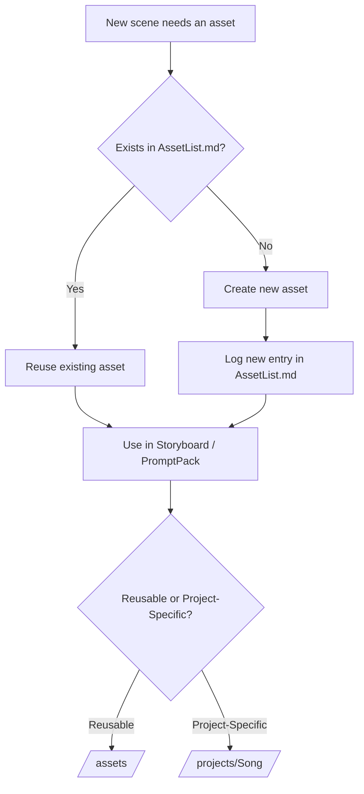
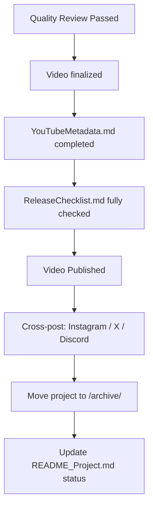
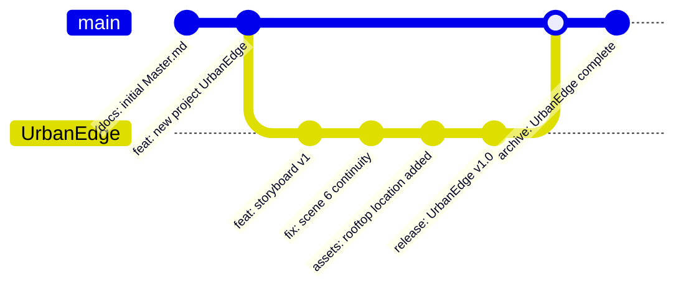
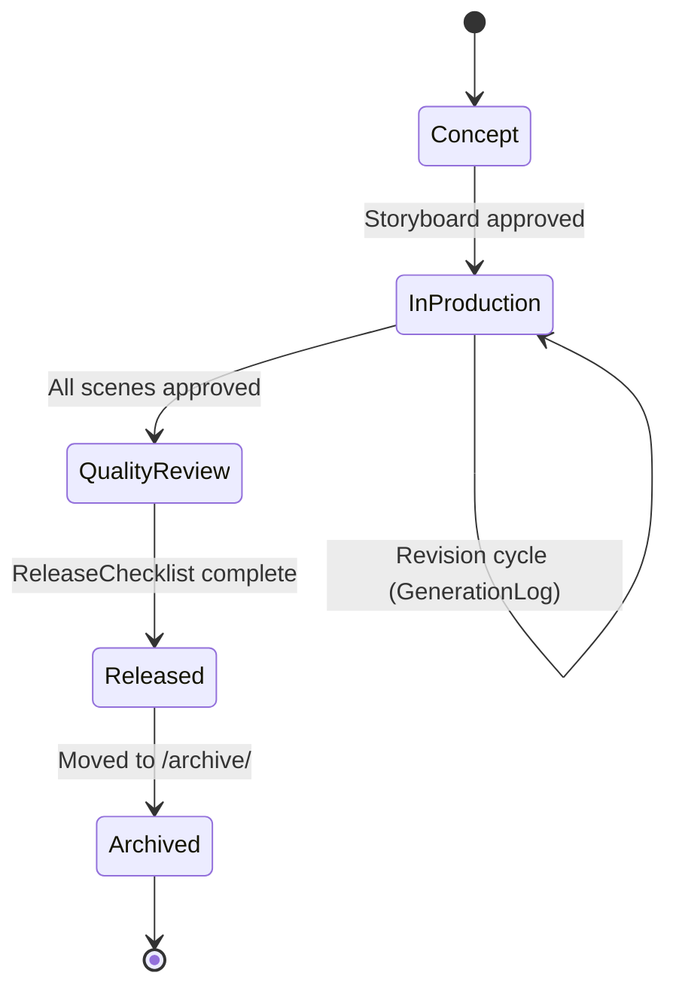
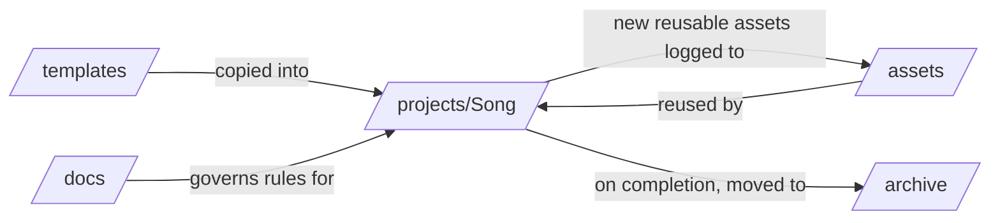
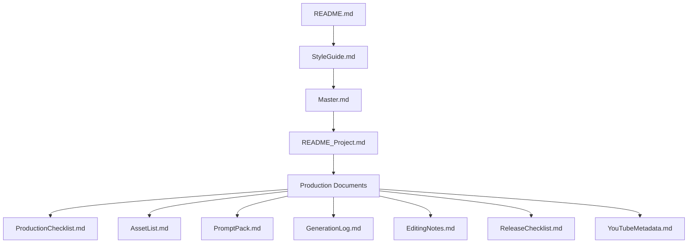

# Production Flowchart

> Visual navigation guide for the NotesSamurai repository. Each diagram below is a Mermaid rendering of a workflow already described in prose elsewhere — `RepositoryGuide.md`, `ProductionFlow.md`, `Master.md`, `StyleGuide.md`. This document does not introduce new rules; it renders existing ones visually.

---

## 1. Repository Structure

**Explanation:** `/docs/` governs the whole studio and never varies per song. `/projects/` holds one folder per song, structured identically. `/templates/` supplies the blank starting point for each new project. `/assets/` and `/archive/` support reuse and long-term history respectively. See `RepositoryGuide.md` Section 2 for full folder definitions.

---

## 2. Production Workflow

**Explanation:** The full pipeline, one stage per node, matching `ProductionFlow.md` exactly. No stage is skipped; each stage's governing document must be complete before the next begins.

---

## 3. Creative Workflow

**Explanation:** The creative loop that happens before any technical production work. A storyboard is not allowed to proceed until the underlying lyrics have been validated against the emotional arc defined in `StyleGuide.md`.

---

## 4. AI Workflow

**Explanation:** Each tool occupies a fixed role, per `RepositoryGuide.md` Section 10. A new tool joining the pipeline takes over an existing role rather than creating a new one — the dotted lines indicate that substitution path.

---

## 5. Asset Workflow

**Explanation:** Reuse is checked before creation, matching `RepositoryGuide.md` Guiding Principle 4 ("Reuse before recreation"). Every asset's destination folder depends on its reusability classification from `AssetList.md`.

---

## 6. Release Workflow

**Explanation:** Release cannot begin until Quality Review has passed. Archiving is the final step, not a parallel one — the project stays active in `/projects/` until publishing and cross-posting are both confirmed complete.

---

## 7. Version Control Workflow

**Explanation:** Commit prefixes match `RepositoryGuide.md` Section 7 exactly. Each song can be developed on its own branch and merged back once released; the archive commit marks the end of that project's active lifecycle.

---

## 8. Project Lifecycle

**Explanation:** A project can loop within "In Production" through revision cycles (tracked in `GenerationLog.md`) but cannot move to Quality Review until every scene is approved, and cannot be archived before release.

---

## 9. Folder Relationship

**Explanation:** Templates flow into projects; docs govern projects without being altered by them; assets flow both directions (used by projects, and contributed back to when a project produces something reusable).

---

## 10. Documentation Hierarchy

**Explanation:** Matches `RepositoryGuide.md` Section 3. Read top to bottom on first encounter with the repository; production documents at the bottom are only meaningful once everything above them has been read.

---

*End of ProductionFlowchart.md — visual companion to `ProductionFlow.md` and `RepositoryGuide.md`. If a diagram and its prose counterpart ever disagree, the prose document governs; update the diagram to match.*
